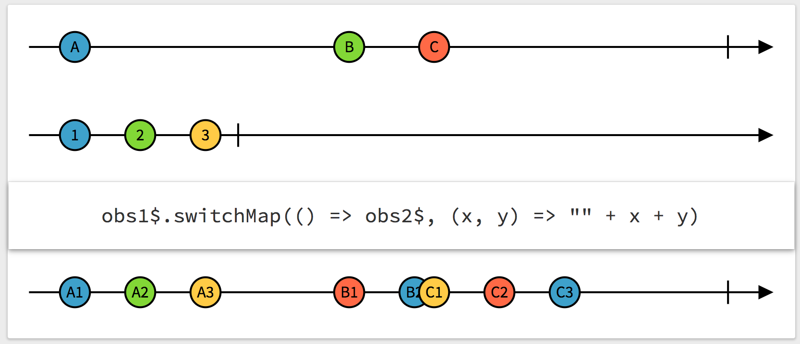

# RxMarbles

A webapp for experimenting with diagrams of [Rx](http://reactivex.io/) Observables, for learning purposes.



#### Features:

- Visualize example diagrams for each operator in Rx
- Drag an item ("marble") on an Observable to see how the operator reacts
- Direct link to any example diagram, e.g., http://rxmarbles.com/#delay

## Implementation

This is a [Cycle.js](https://github.com/staltz/cycle) app. Use this as an example implementation of advanced custom elements in Cycle.

## Contributing

Fork and git clone the repository.

```
npm install
```

The roadmap is entirely specified in the [TODO](https://github.com/staltz/rxmarbles/blob/master/TODO) file, which follows the [git-done](https://github.com/staltz/git-done) syntax. You can also use `git done` instead of `git commit` if you wish. For minor bug fixes, you won't need to deal with the TODO file. But if you're building a feature, remember to write a `DONE` entry before you commit and send the pull request.

The build system is using npm scripts. To develop, build the project with `npm run build`.

And access the site on your local machine as `file:///path/to/rxmarblesrepo/index.html`.

Make a [pull request](https://github.com/staltz/rxmarbles/pulls) when you're ready.
